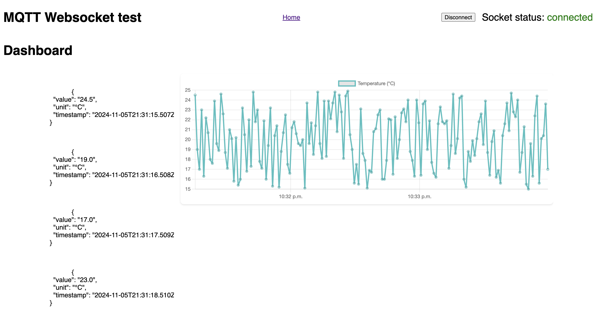

# IoT Mock Project

A quick IoT prototype built in 2-3 hours using Cursor editor (VSCode with AI) and TypeScript libraries. This project simulates data flow from a sensor to a real-time dashboard via MQTT and WebSocket.



## Project Structure

```
├── app         
├── dashboard     
├── mqtt_broker  
└── server       
```

## Components

- **App**: Simulated sensor generating and sending data to the MQTT broker.
- **Dashboard**: Svelte (not SvelteKit) UI for real-time data visualization using `socket.io`.
- **MQTT Broker**: Manages data flow from the sensor to the server.
- **Server**: WebSocket server forwarding data from MQTT broker to dashboard.

## Setup

1. **Clone the Repository**
    ```bash
    git clone https://github.com/ivanmachine/MQTT_Websocket_test
    cd MQTT_Websocket_test
    ```
2. **Install Yarn**
    ```bash
    npm install -g yarn
    ```

3. **Use Node.js version 21**
    ```bash
    nvm install 21
    ```

4. **Run install script**  
   Run `yarn install` in the root folder.

5. **Run dev script**  
   Run `yarn dev` in the root folder.

## License

Basically, do whatever you want with it.
